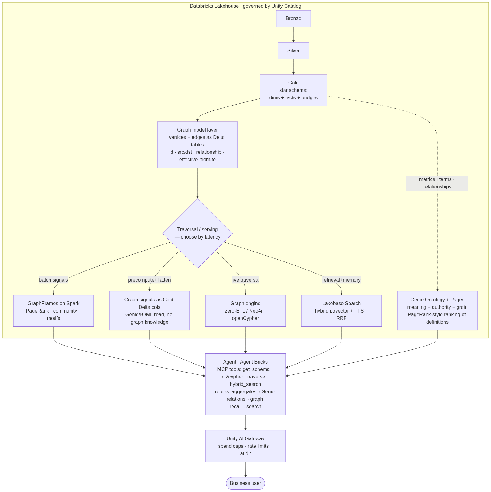
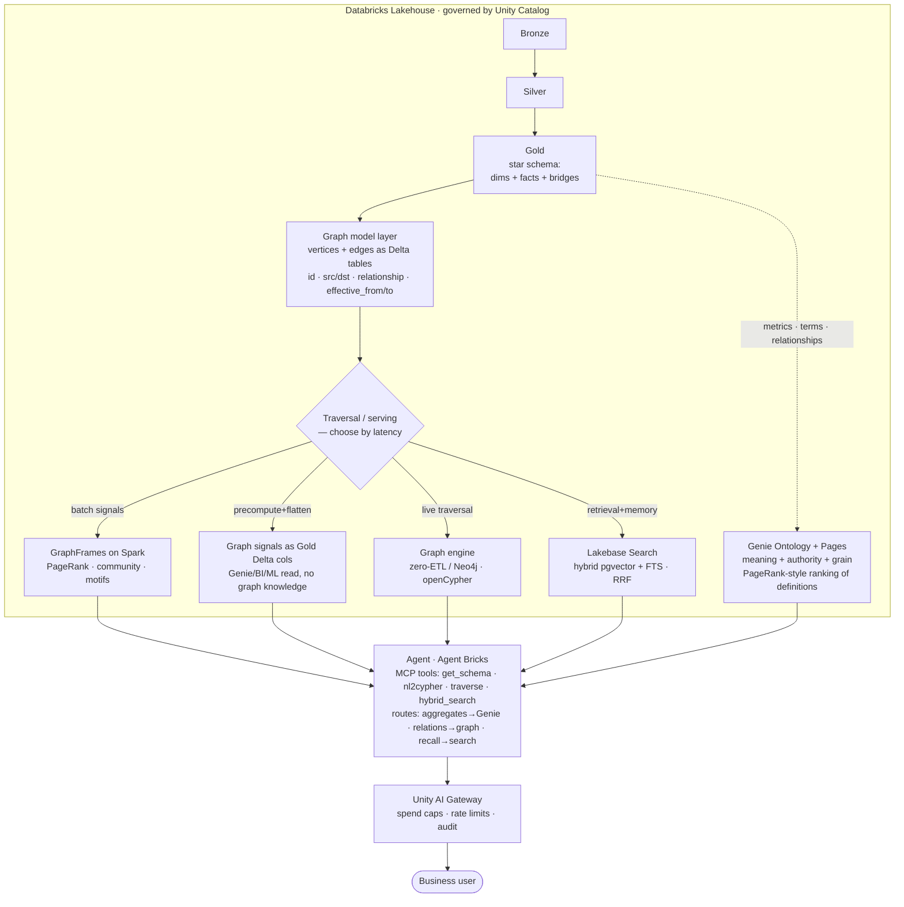
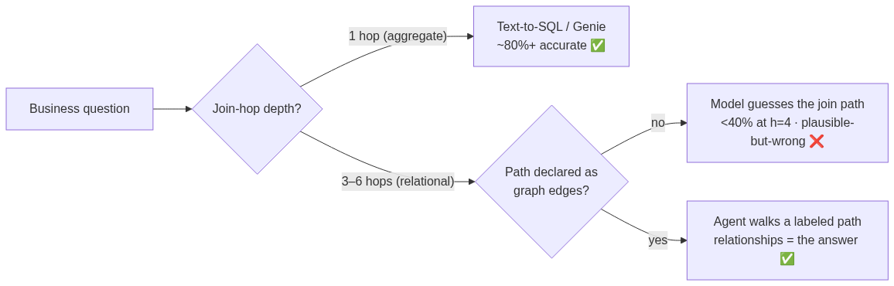
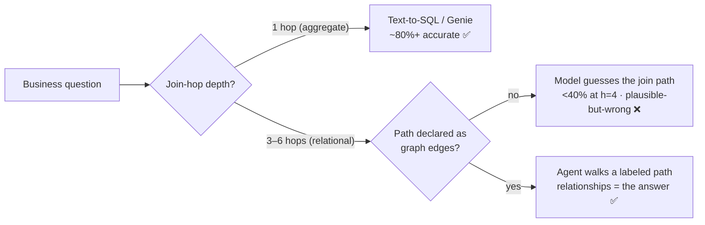
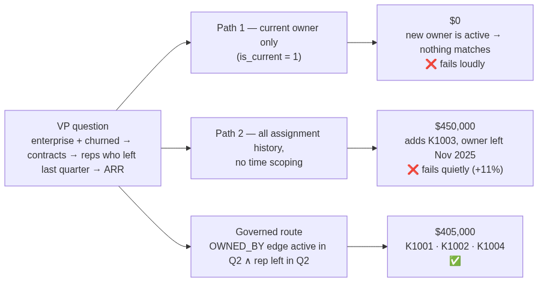
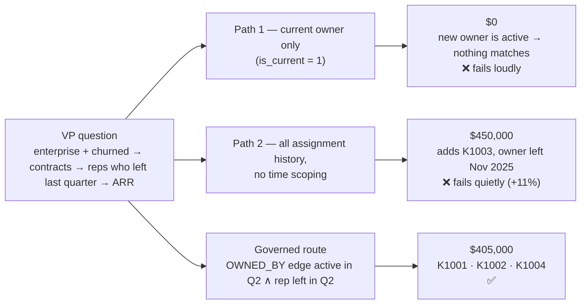

# Architecture

Three diagrams from the article, rendered beside their Mermaid source.

## 1. Gold → graph → agent, all inside Unity Catalog

This repository implements the **model layer** (`graph_model.py`, `repository.py`), the **governed
route** a traversal would take (`strategies/graph_path.py`, mirrored as a GraphFrames motif in
`notebooks/`), and the **comparison an agent should run before trusting a number**
(`comparison_service.py`, `cli.py`). Ontology, live graph engines, search and the gateway are the
platform's job and are discussed in the article.

## 2. Why the graph: the join-hop cliff

## 3. The walk-through: three paths, three answers

## The data, in one glance

| Table | Rows | Role |
|---|---|---|
| `dim_customer` | 5 | customer, segment, status (churned/active) |
| `dim_rep` | 5 | rep, status (left/active), `left_date` |
| `fact_contract` | 5 | contract → customer, `arr_usd` |
| `bridge_account_assignment` | 8 | **the hidden bridge**: contract → rep, `effective_from` / `effective_to`, `is_current` |

Sam Rivera (left 2026-04-15) and Casey Morgan (left 2026-05-20) owned K1001/K1004 and K1002 until
2026-06-30; Jordan Lee (active) took over on 2026-07-01. Taylor Brooks (left 2025-11-30) owned K1003
until 2025-11-30; Alex Kim (active) since 2025-12-01. That is exactly enough structure to make the
current-owner path return $0 and the all-history path return $450,000.
